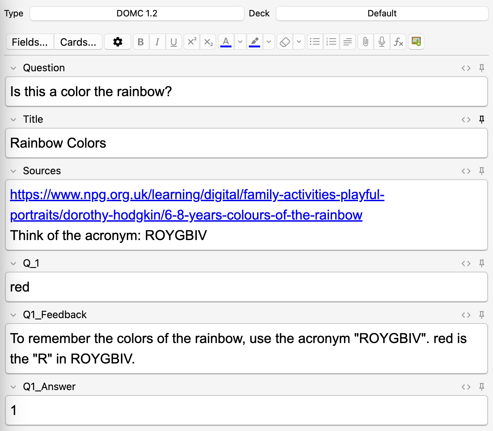
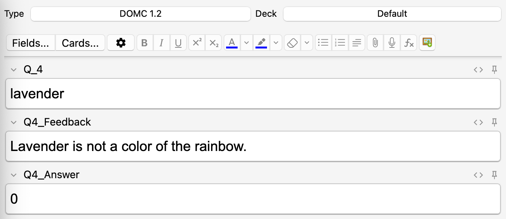

<!-- omit in toc -->
# Discrete Option Multiple Choice for Anki

Adds discrete option multiple choice (DOMC) cards to Anki. A fork of [Multiple Choice for Anki](https://ankiweb.net/shared/info/1566095810).

For more information on DOMC-style questions see [Caveon's website](https://domc.caveon.com/home).

- [Why DOMC questions over regular multiple choice?](#why-domc-questions-over-regular-multiple-choice)
- [Compatibility](#compatibility)
- [Usage](#usage)
  - [Creating / Editing](#creating--editing)
  - [Card creation example](#card-creation-example)
  - [Reviewing](#reviewing)
  - [TODO:](#todo)
- [License and Credits](#license-and-credits)

## Why DOMC questions over regular multiple choice? 
- With multiple choice questions, you are presented ALL answers at the same time. This allows you to easily deduce the right answer from answers that are clearly wrong, even if you don't actually know the right answer.
- With DOMC questions, each answer is presented to you one at a time, meaning you can't use the context of other options to guess the right answer. You answer "yes" or "no" to each option. Options are presented one at a time in random order.

## Compatibility

Anki 2.1.44 or higher is required for this add-on to work.

Cards created with this add-on can be reviewed on desktop. NOT Tested on mobile yet. 

## Usage

### Creating / Editing

The note type is automatically added the first time you start Anki after installing the add-on.

When creating cards, write a "1" for correct choices or a "0" for incorrect choices in the "Answers" field.

### Card creation example
Let's say you have a question like the following: 

Question: **Is this a color of the rainbow?**
| Option       | Answer | Feedback (on why answer is yes or no)                                                          |
|--------------|--------|------------------------------------------------------------------------------------------------|
| red          | yes    | To remember the colors of the rainbow, use the acronym "ROYGBIV". red is the "R" in ROYGBIV.   |
| blue         | yes    | To remember the colors of the rainbow, use the acronym "ROYGBIV". blue is the "B" in ROYGBIV.  |
| green        | yes    | green is the "G" in ROYGBIV                                                                    |
| lavender     | no     | Lavender is not a color of the rainbow.                                                        |
| indigo       | yes    | indigo is the "I" in ROYGBIV                                                                   |
| yellow       | yes    | yellow is the "Y" in ROYGBIV                                                                   |
| yellow-green | no     | yellow-green is not a color of the rainbow.                                                    |

You would fill in the fields of the Anki card like this for a "yes" answer: 

...and like this for a "no" answer.

### Reviewing
Select the correct and incorrect choices accordingly and click "Show Answer".

The add-on will automatically calculate what percentage you answered correctly. Note that on a real test, DOMC questions are all-or-nothing, meaning you could answer correctly to 90% of the options and still earn zero credit. 

### TODO:
- Make the card creation process a little more user friendly. I don't like the idea of having THREE fields for one different option, but I don't see a way to have multiple values for one field without introducing higher chances of user error.
- Test the cards on mobile. Not sure if they work or if they would be difficult to view. 
- Make the styling prettier, eventually, because I can!
- Pray there are no bugs.

## License and Credits

This project is licensed under the AGPLv3.
For more information refer to the [LICENSE](https://github.com/zjosua/anki-mc/blob/master/LICENSE) file.

*Discrete Option Multiple Choice for Anki* is *Copyright © 2023 [katinathongvong](https://github.com/katinathongvong)*

*Multiple Choice for Anki* is *Copyright © 2023 [3ter](https://github.com/3ter) and [zjosua](https://github.com/zjosua)*

A bunch of code in this add-on is based on the Anki add-ons [Image Occlusion Enhanced](https://github.com/glutanimate/image-occlusion-enhanced) and [Cloze Overlapper](https://github.com/glutanimate/cloze-overlapper) by Glutanimate.
[Click here to support Glutanimate's work](https://glutanimate.com/support-my-work/).

Persistence is achieved using the code from [Simon Lammer's anki-persistence](https://github.com/SimonLammer/anki-persistence).
Great work Simon!

[Hax](https://github.com/Schlauer-Hax) merged the Multiple Choice card template with Simon Lammer's persistence code.
He also reworked the card templates into one single all-in-one template.
Thanks a lot!

Simon's and Hax's work made the multiple choice cards compatible with all platforms.

Volker Umpfenbach contributed a change that allows to customize how the questions and answers are colorized.
He also provided the code to calculate and display the percentage of correctly answered items per question.

This add-on uses the [packaging](https://packaging.pypa.io/en/latest/) library.
